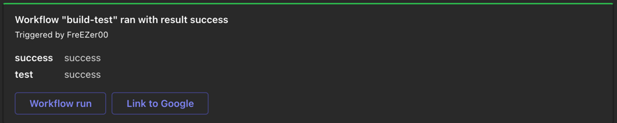

<h1 align="center">Microsoft Teams Webhook Action </h1>

<p align="center">
  <a href="https://github.com/FreEZer00/teams-webhook-action/actions/workflows/test.yml"></a>
  <a href="https://github.com/FreEZer00/teams-webhook-action/actions/workflows/codeql-analysis.yml"></a>
  <a href="https://github.com/FreEZer00/teams-webhook-action/actions/workflows/check-dist.yml"></a>
</p>

-------

<p align="center">
    <a href="#whats-included">What's included 🚀</a> &bull;
    <a href="#setup">Setup 🛠️</a> &bull;
    <a href="#sample">Sample 🖥️</a> &bull;
    <a href="#license">License 📓</a>
</p>

-------

## What's included

- Teams Webhook client
- Supports for additional action buttons
- Automatic status deduction from job/needs results
- Dry run debugging option
- Type safety

This action sends a defined message card to an incoming teams webhook.

Inspired by actions from [Skitionek](https://github.com/Skitionek/notify-microsoft-teams)
and [homoluctus](https://github.com/lazy-actions/slatify).

## Setup

### Configure the workflow

```yml
name: build
on:
  pull_request:

jobs:
  testJob:
  runs-on: ubuntu-latest
  steps:
    - uses: actions/checkout@v3
    - run: |
        exit 0
  build:
    name: Checkout and notify
    needs: [ TestJob ]
    if: ${{always()}}
    runs-on: ubuntu-latest
    steps:
      - name: Checkout Code
        uses: actions/checkout@v1
      - uses: freezer00/teams-webhook-action@v1.4.1
        with:
          webhook_url: ${{secrets.webhook}}
          needs: ${{ toJson(needs) }}
          job: ${{ toJson(job) }}
          title: Custom title
          additional_button_title: |-
            Link to Google
            Link to Microsoft
          additional_button_url: |-
            https://google.com
            https://www.microsoft.com/de-de/microsoft-teams
          hide_facts: false
          dry_run: false
```

### Inputs

| **Input**                 | **Required** | **Description**                                                                                                                                                                           |
| ------------------------- | ------------ | ----------------------------------------------------------------------------------------------------------------------------------------------------------------------------------------- |
| `webhook_url`             | **Required** | [Teams Webhook](https://learn.microsoft.com/en-us/microsoftteams/platform/webhooks-and-connectors/how-to/add-incoming-webhook) - url of the incoming webhook (should be store in secrets) |
| `title`                   | Optional     | Custom title for the message card. Default `Workflow \"<workflow-name/>\" ran with result <result/>`                                                                                      |
| `job`                     | Optional     | JSON formatted job `toJson(job)` (current job)                                                                                                                                            |
| `needs`                   | Optional     | JSON formatted needs `toJson(needs)` (previous required jobs)                                                                                                                             |
| `additional_button_title` | Optional     | Multiline input for additional titles of potential actions on message card see [test.yml](.github/workflows/test.yml))                                                                    |
| `additional_button_url`   | Optional     | Multiline input for additional links of potential actions on message card see [test.yml](.github/workflows/test.yml))                                                                     |
| `hide_facts`              | Optional     | Keept the notification short and omit the facts (needs) in the message card (default `false`)                                                                                             |
| `dry_run`                 | Optional     | Skip the sending of the webhook to Teams (default `false`)                                                                                                                                |

## Sample

<div>
  
</div>

## License

[The MIT License (MIT)](LICENSE)
